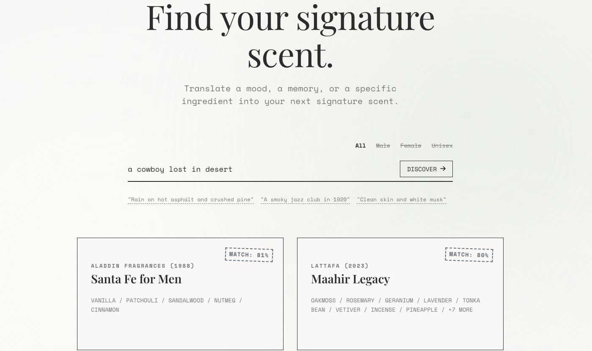

# L'Aura - Cologne Recommendation Engine

An end-to-end NLP recommendation system that matches users to fragrances using natural language descriptions rather than rigid categorical filters.

**Live Demo:** [https://laura-4klo.onrender.com/](https://laura-4klo.onrender.com/)



---

## How It Works

User queries are embedded into a 384-dimensional vector using `sentence-transformers`. These are compared via cosine similarity against a pre-built ChromaDB index of around 4,000+ fragrances. Each fragrance in the index is represented by a rich context string combining its olfactive notes and a truncated excerpt of real user reviews, allowing the system to surface semantically aligned results even when queries contain no explicit ingredient references.

---

## Tech Stack

| Layer | Technology |
|---|---|
| Embedding Model | `sentence-transformers/all-MiniLM-L6-v2` |
| Vector Database | ChromaDB (PersistentClient) |
| Relational Database | SQLite (`colognes_basenotes.db`) |
| Backend API | FastAPI + Uvicorn |
| Data Acquisition | `nodriver` (Cloudflare bypass), BeautifulSoup |
| Containerisation | Docker |
| Deployment | Render |

---

## Dataset

~4,000 fragrances scraped from Basenotes.com across 100 directory pages. Each record stores:
- Brand, Name, Gender
- Olfactive notes (Top, Mid, Base) via relational SQLite tables
- Aggregated user review text for semantic context

---

## Running Locally

```bash
# 1. Install dependencies
pip install -r requirements.txt

# 2. Build the ChromaDB index
python src/ml_pipeline.py

# 3. Start the API server
python src/api.py

# 4. Open http://localhost:8000
```

---

## Limitations

- **Static dataset**: The index is built once at deploy time. New fragrance releases require a re-scrape and re-index.
- **Gender metadata**: Scraped gender classifications from the source site had inconsistencies. Gender filtering is handled semantically at query-time rather than as a hard metadata filter.

---

## Future Work

- Price filtering and product imagery on result cards
- Automated Cron-based re-scraping for a live, updating library
- User profiles and saved fragrance wardrobe
